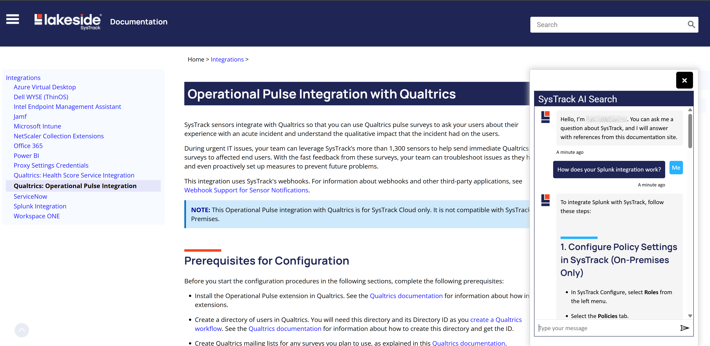
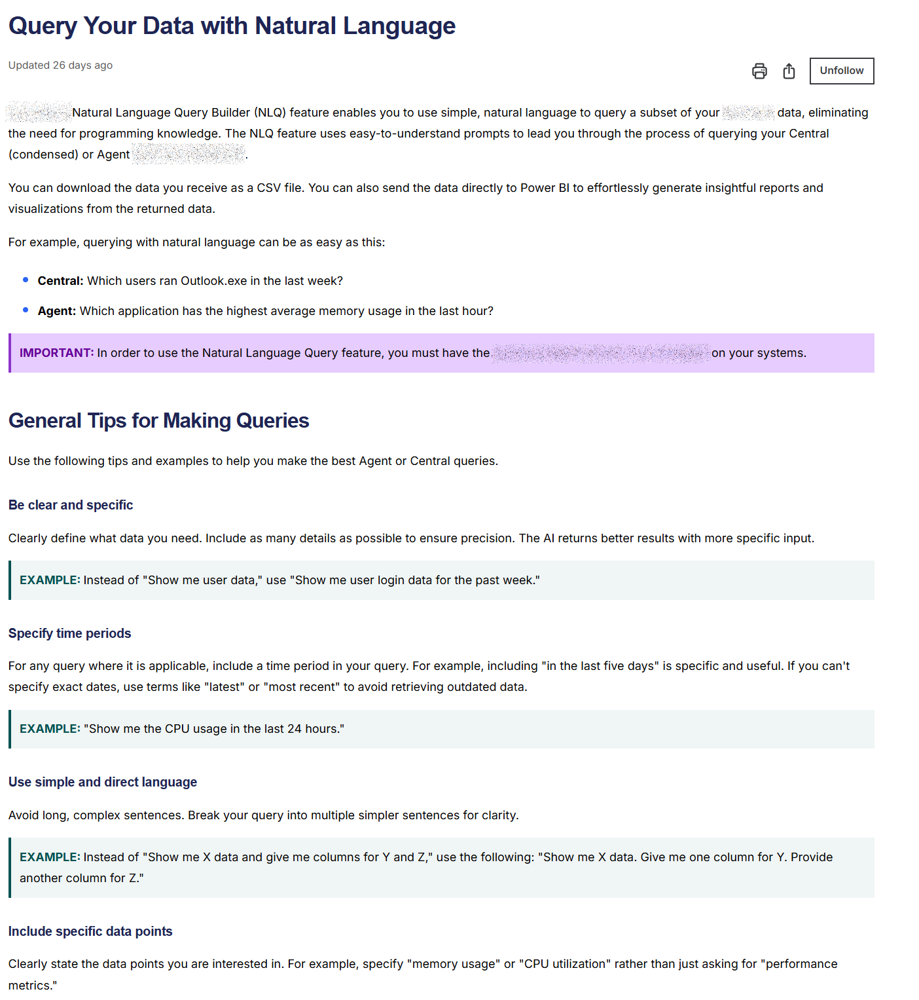

# Artificial intelligence (AI)

The following sections show examples of work that I\'ve done with AI
tools and docs that I\'ve created about AI features.

## Copilot Agent

To meet company AI goals, I used Microsoft Copilot Studio to build an
agent to search a very large data set and provide answers for users.

After building and publishing the agent, I used Microsoft\'s Bot
Framework to style and brand the Copilot Agent as a pop-up chat window.
Then I embedded it into the company\'s documentation portal (currently
in beta). Here is a screen shot:

## AI tools in documentation workflows

To meet company goals and to generally accomplish MORE with fewer
resources, I have integrated AI tools such as ChatGPT and Microsoft
Copilot into documentation workflows in various ways that I\'m happy to
discuss with anyone.

## Documentation for AI features

I have used, tested, and written documentation for AI features in
company products. One example is a [Natural Language Query
Builder](https://documentation.lakesidesoftware.com/en/Content/NaturalLanguageQueries/NLQ01Landing.htm)

