

# SMS Integration with Twilio Marketplace User Guide

The SMS Integration with Twilio provides the ability to configure Short
Messaging Service (SMS) notifications within the UKG Ready application.
When this integration is added and set up, SMS message configuration
will be available in the following areas:

- Global Notifications

- Workflow Notifications

- Communication Templates (HR only)

Twilio offers a global platform that makes sending SMS notifications
easy.

- Send SMS messages with local and toll-free numbers, short codes,
  custom alphanumeric sender IDs, or by using your own existing phone
  numbers.

- Send Multimedia Messaging Service (MMS) messages. Outside the U.S. and
  Canada, attachments are sent as links.

- Send text messages over the carrier network to any phone, anywhere in
  the world.

- Automatic route monitoring ensures that long-code phone numbers are
  used to send messages when a carrier is unable to receive messages
  from short codes, and that global messages always take the best path.

- Send long messages and Twilio will automatically segment and
  reassemble them.

- Messages sent to the same person automatically uses a previously
  recognizable phone number to create a consistent experience and
  maintain conversation history.

You must set up an account with Twilio prior to using this functionality
with Workforce Ready. We have provided links under the **Pricing** tab
of the Marketplace product to help you contact them, view Twilio pricing
structures, and other Twilio support information.

[Download
this User Guide as PDF](https://lookatthem-tech.github.io/portfolio001/Content/Topics/Developers/SMSIntegrationTwilioUG/SMSIntegrationTwilioUG.pdf)

## Requirements and Prerequisites

To take advantage of SMS functionality, you must complete a few steps
prior to using it. First, you must add the **SMS Integration with
Twilio** marketplace product. Once added, there are a few housekeeping
steps to complete in your company. Once that is done you will then be
able to select SMS options within company notifications.

### Download the Marketplace Product

To add the marketplace product, navigate to **Marketplace \> Marketplace
Setup** and add the **SMS Integration with Twilio** marketplace product
to the company.

> **Note:** The
marketplace product contains links and information to Twilio. You must
create a Twilio account and gather information from them before you can
complete the final installation of the product.

- From the **Home** or **Search/Browse** tab, locate and click the **SMS
  Integration with Twilio** product hyperlink.

- Click **Add To Company**. You will be prompted to sign the **Terms And
  Conditions** page.

- After signing the **Terms And Conditions**, select a security profile
  for the users who will manage this product. This is typically the
  Company Administrator.

- After clicking **OK**, the system will process for a bit and when
  finished, a **Success** message will display.

- You can verify the installation on the **Installed** tab.

After you've created your Twilio account, the next step is to edit the
marketplace product settings and add your Twilio information.

- Under the **Installed** tab, click the edit icon for the product.

- Input the Twilio **Account SID**, **Authentication Token**, and
  **Messaging Service SID** into the appropriate fields.

#### Global Setup

Once your marketplace product is installed and completed, you will then
need to edit a few settings in your company.

Enable SMS notifications globally. Multiple options are available. After
selecting an option here, SMS fields will then become available in the
application. Skipping this step will result in no SMS settings being
available. Optionally, you can configure a custom SMS Header that will
be appended to the front of each SMS notification.

Navigate to the **Company Configuration** widget under the **Company
Info** tab, located under **Company Settings \> Global Setup \> Company
Setup**, and select an SMS option in the **Notifications Through**
field.

[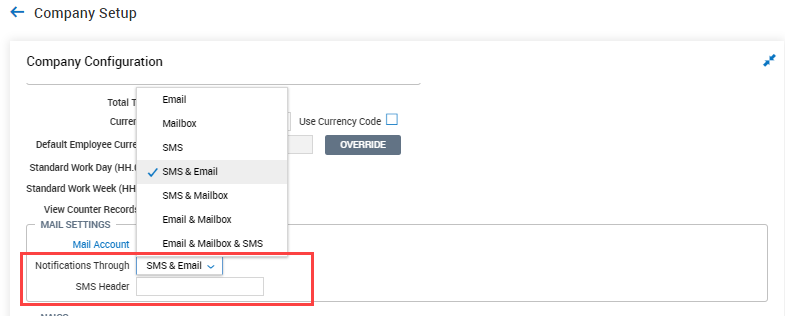](./SMSIntegrationTwilio.png)

**SMS**: Will use only SMS messaging.

**SMS & Email**: Will use SMS messaging and allow the email option as
well.

**SMS & Mailbox**: Will use SMS messaging and allow the user's mailbox
to receive messages.

**Email & Mailbox & SMS**: Will use SMS messaging, user mailboxes, and
email.

**SMS Header:** In this field, you can optionally type a customized
header that will be appended to the front of each SMS message sent from
the system. For example, you may want to alert recipients who the alert
is coming from by entering your company name in this field, i.e.,
OURCOMPANY: rest of header.

Employees can enable/disable SMS in notification preferences. End users
will be able to toggle their own SMS notification preferences under **My
Info** \> **My Information \> Notification Preferences**.

[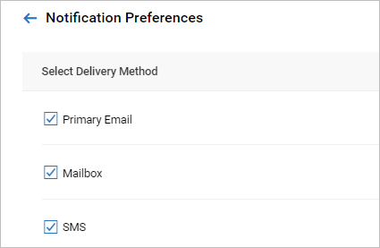](./SMSIntegrationTwilio_1.png)

Broadcast Messaging can be turned off by unchecking the related boxes
for Broadcast Email, Broadcast Mailbox, and Broadcast Message SMS.
Unchecking these has no effect on the options under them for Primary
Email, Mailbox, and SMS. If Primary Email, Mailbox or SMS are disabled,
the corresponding Broadcast Messaging option is disabled as well.

[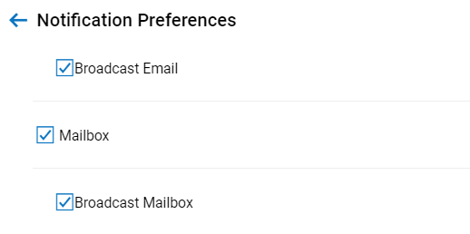](./SMSIntegrationTwilio_2.png)

> **Note:** To
comply with Twilio and industry standards, end users will be able to
reply with STOP, CANCEL, etc. to any SMS notification. If they do,
notification preferences will be updated in the application to disable
SMS. Notification preference changes can be audited in the Account Audit
Trail report as well.

[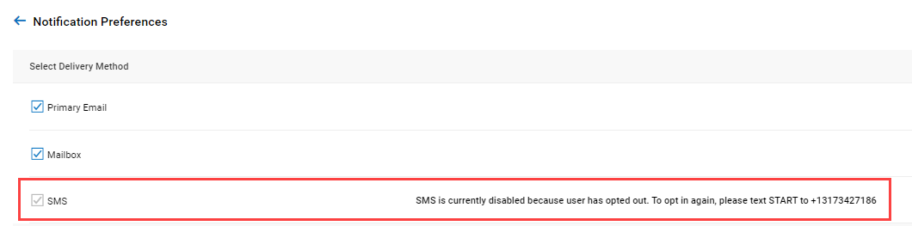](./SMSIntegrationTwilio_3.png)

## Configuring Communications with SMS

You can configure the system to use SMS in notifications, workflows, and
recruitment.

### SMS in Notifications

Once your company has been edited to enable SMS messaging fields, you
can then begin using SMS messages in notifications. Notifications are
configured under **Company Settings \> Global Setup \> Notifications**.

Depending what was selected in **Company Setup** will determine the
fields available in notifications. The **SMS Message** will be disabled
by default. Check the **Enabled** checkbox to activate the message
options. Once enabled, you can then type a customized message and use
the system tags to create a message. The messages have a 1400-character
limit.

[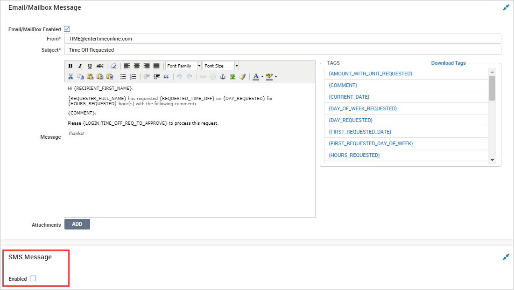](./SMSIntegrationTwilio_4.png)

[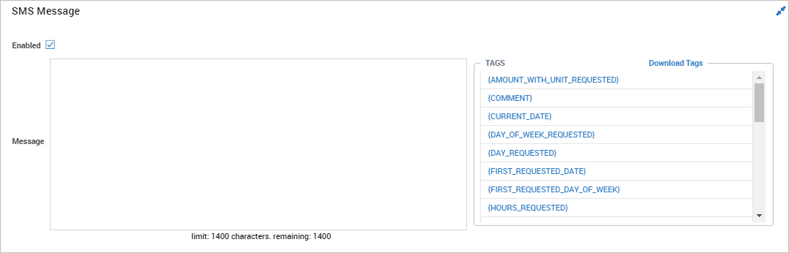](./SMSIntegrationTwilio_5.png)

### SMS in Workflows

SMS notifications can also be added to the **Generate Notification**
step in workflows. This will generate a SMS message to the designated
recipient when the workflow proceeds to the **Generate Notification**
step. Workflows are located under **Company Settings \> Global Setup \>
Workflows**. The **SMS Enabled** checkbox will be unchecked by default.
Check to activate the SMS messaging options.

[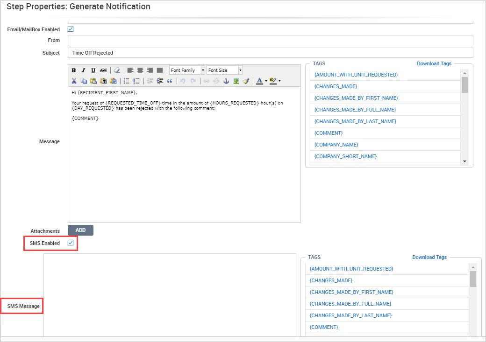](./SMSIntegrationTwilio_6.png)

### Two-Way SMS in Workflows

When using workflows, users can leverage Two-Way SMS functionality when
it comes to approvals or rejections of actions within the particular
workflow. This is configured in the same place as mentioned above (in
the Generate Notifications step). You will want to apply this to the
notifications step that comes before the Approval/Reject Manager step.

As you click the SMS Enabled checkbox, you will see another option for
Two Way SMS Enabled that will need to be checked.

As the SMS Message text space appears, configure your message using free
text and tags as normal.

When the workflow is triggered and the notification is sent, the manager
will see the message as formatted by the user in configuration. This
will immediately be followed by a canned set of instructions to explain
how to advance the workflow: Please reply Y/N followed by this code
\<code\> to Approve/Reject this request. The code is very important as
this is a unique value tied to each request. As a manager, you could
receive multiple requests for one workflow and the system needs to know
which specific request is being approved or denied.

There is error proofing built into this process as well. If an incorrect
code is entered, the system will let you know (similarly if you enter
the same code twice).

#### Two-Way SMS Workflows: Required Comment

You can configure a Workflow to allow for a SMS response to Approve or
Reject, plus any required Comment, so that users can Approve/Reject a
Workflow that includes a Comment and submit it via SMS. When the
Workflows listed below are sent through SMS Two-Way, the user is
notified that a Comment is required in addition to their Approve/Reject
and unique code.

- Time Off Request

- Timesheet

- Timesheet Change Request

- Schedule

- Schedule Open Shift

- Schedule Request for Coverage

- Schedule Shift Swap

- Compensation Proposal Request

### SMS in Recruitment

If you are using the Recruitment marketplace product, SMS communication
can be configured in communication templates. This will allow managers,
hiring managers, and HR professionals to communicate with applicants via
SMS messaging.

#### Communication Templates

Communication Templates can be selected by the manager or HR
professional when communicating with an applicant. The communication
templates are located at **Company Settings \> HR Setup \> Applicant
Tracking/Recruitment \> Templates Library \> Communication Templates**.
The **SMS Enabled** checkbox will be unchecked by default. Check to
activate the SMS messaging options.

> **Tip:** Make
sure to check the Active checkbox in the notification to make it
available.

[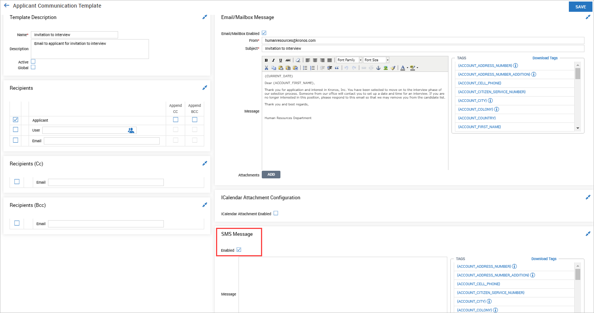](./SMSIntegrationTwilio_11.png)

#### Communications with Applicants

When managers or HR professionals choose to communicate with an
applicant, they can choose one of the preconfigured communication
templates or create a customized message. Managers can communicate with
applicants in the following areas:

- **Team \>** **Recruitment \> Candidates \> Applicants**

- **Team \>** **Recruitment \> Candidates \> Job Applications**

In both areas, users will select one or more applicants or job
applications and select the **Communicate To Selected** button. In the
pop-up, you can select a communication template from the **Template To
Use** icon. When selecting a template, it will populate the Email area
(if enabled at the company level), and the SMS area with content from
the template. Users can edit as needed.

If not using a template, users can create their own customized messages
and use system tags to complete the message.

##### Applicants and Job Applications

After selecting one or more entries and clicking the **Communicate To
Selected** button, the pop-ups will allow you select a template, create
customized messages, or turn off/on certain communication methods.

[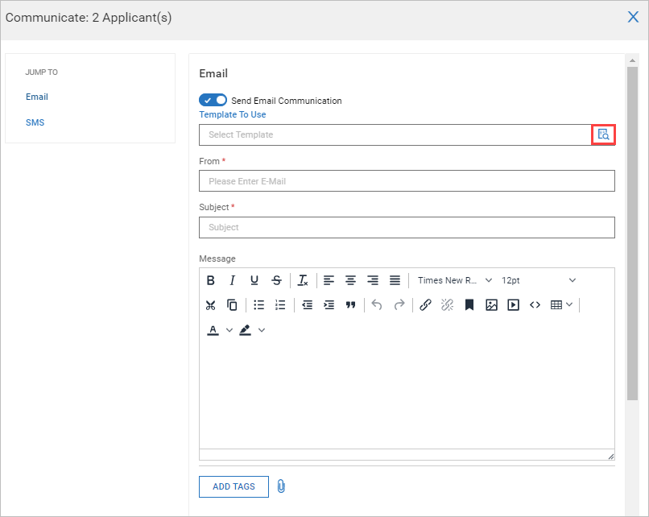](./SMSIntegrationTwilio_12.png)

[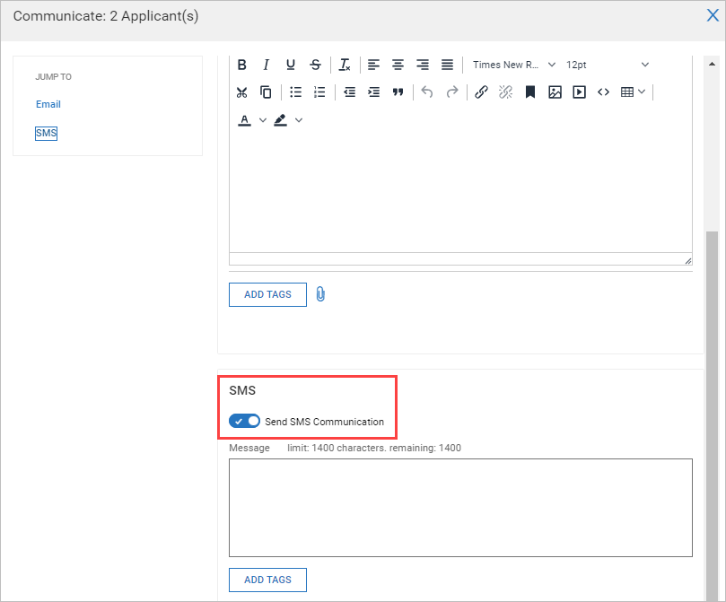](./SMSIntegrationTwilio_13.png)

##### Job Requisitions and Applicant Information

When opening a Job Requisition for viewing or editing, an option is
available to **Notify Applicant** which is a manual method of
encouraging an applicant to apply for the job. After selecting the
option and adding an applicant, a communication pop-up will display
where you can craft a communication to the applicant. You can select a
communication template or create a customized message. The options
available here will depend on what was selected on the **Company Setup**
page (Email, SMS, etc.).

Job Requisitions are located under **Team \>** **Recruitment \> Job
Requisitions**.

[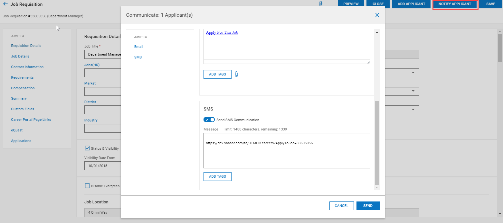](./SMSIntegrationTwilio_14.png)

When viewing or editing an applicant, the **Applicant Information** page
will open and contains multiple tabs and **Jump To** links. On the
**Communications** tab, you can select various communication options. In
the **Interviews** widget, in the Actions ellipses, you can add an
interview (if none are listed). Once added, the Actions ellipses in the
entry will have the **Communicate** option. When selected, a pop-up will
display. This pop-up contains the SMS option, as well as the iCalendar
Attachment option. The options available here will depend on what was
selected on the **Company Setup** page (Email, SMS, etc.)

If there are multiple options in the lists, and you want to send the
same communication to all selected, you can select the entries and then
click the **Communicate** button on the page.

Applicant Information is located under **Team \>** **Recruitment \>
Candidates \> Applicants**. Then open/view an applicant from the list.

[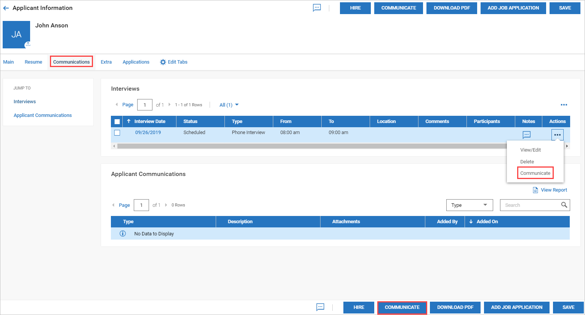](./SMSIntegrationTwilio_15.png)

[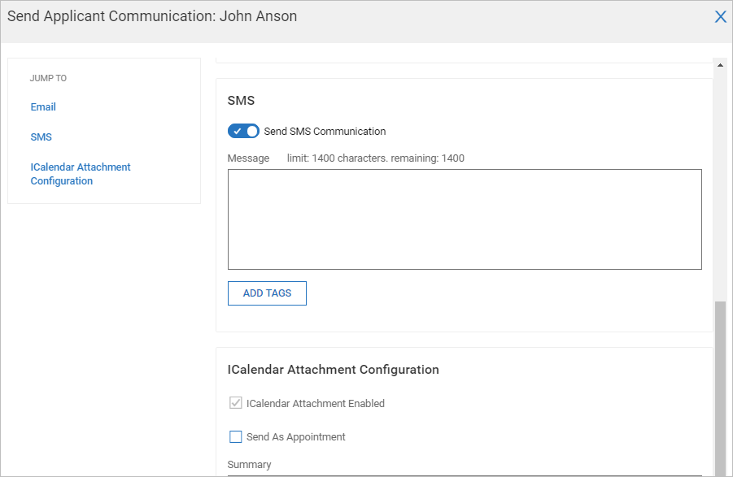](./SMSIntegrationTwilio_16.png)

In the pop-ups, you will have the option to turn off or on each area of
communication via the slider bubble.

**On**

[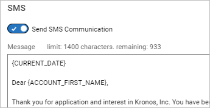](./SMSIntegrationTwilio_17.png)

**Off:** The content will remain, but will be grayed out.

[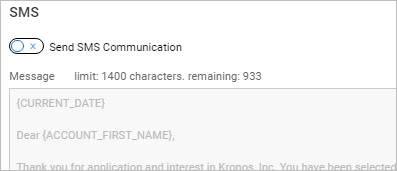](./SMSIntegrationTwilio_18.png)

> **Tip:** If
iCalendar Attachment is enabled within any of these areas, an iCalendar
attachment will be delivered with the notification in the form of an MMS
message.

## Broadcast Messaging

Broadcast messaging is a form of communication that allows
administrators and managers to send messages to employees en masse.
While this form of communication is intended for multiple recipients, it
can also be used to send messages to single recipients. Templates can be
defined and applied to make creating and managing communications easier.

If you have enabled and are using Broadcast Messaging, there are options
to send these communications via SMS.

> **Tip:** Broadcast Messaging is enabled
within the **Mail Settings** widget on the **Company Info** tab under
**Company Settings \> Global Setup \> Company Setup**.

## Broadcast Messaging Templates

Within the templates, messages can be defined in the SMS Message text
box. SMS messages are limited to 1400 characters and if copying messages
from the Email/Mailbox area, the formatting will not be retained in the
SMS Message area.

An iCalendar attachment and appointment can be defined and is supported
for SMS messages.

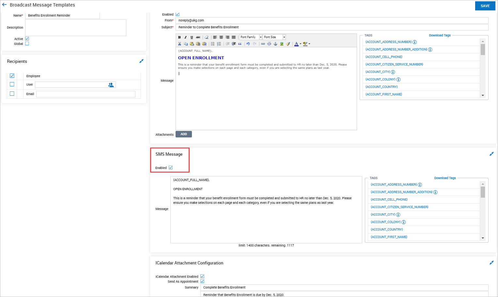

### Broadcast Messaging: Security Permissions

You can restrict certain users or security profiles from being able to
create or send Broadcast Messages. A security item titled **Send
Broadcast Communication** is located on the HR Tab, in the Employee
Related Functions widget of the security profiles.

If this security item is enabled, the user has the **Communicate**
button displayed as an option on the Employee Information screen and any
other applicable screens. If this item is disabled, the user does not
have the **Communicate** button as an option.

### Company Setup SMS Opt In Procedure

Companies with SMS Integration with Twilio already enabled must have
record of employees opting in to receive notifications via SMS to be
compliant with the Telephone Consumer Protection Act (TCPA) opt-in
regulations. An option in the **Mail Settings** section allows existing
companies with Twilio Integration enabled to become compliant.

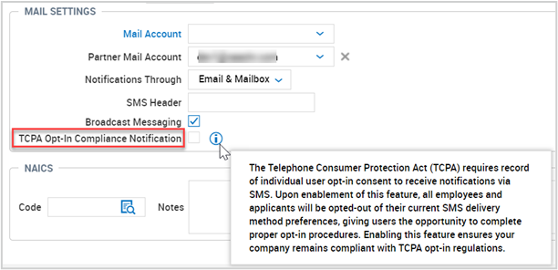
 

The checkbox, **TCPA Opt-In Compliance Notification**, can be enabled
under **Global Setup \> Company Setup \> Company Info** tab, in the
**Mail Settings** section. For companies that already have the Twilio
Marketplace Product added, the checkbox is unchecked. When checked, a
pop-up notification provides the following text:

> Are you sure you want enable this feature? Upon enablement of this
feature, all employees and applicants will be opted-out of their current
SMS delivery method preferences, giving users the opportunity to
complete proper opt-in procedures.

When the feature is enabled, the company does not have an option to
disable it. After the feature is enabled, all users are opted out. An
**Announcement: Opt-In to SMS Notifications** pop-up is shown upon the
next login for each employee, including new accounts. The pop-up
explains:

> You are currently opted-out of SMS notifications. Please navigate to
your \[notification preferences\] screen to opt-in.

### SMS Opt In Procedure for New Companies

Companies using SMS to communicate to their employees need to gather
consent from each employee to send them text messages. When SMS is
enabled on a Company Account via Twilio integration, all employee
accounts including applicants and future hires default to SMS disabled
until the employees OPT IN to receive text messages in their
Notification Preferences.

### Notification Burst When TCPA is Enabled

When the **TCPA Opt-In Compliance Notification** checkbox is enabled in
the Company Setup, all existing applicants are opted out of the SMS
notification preference. To ensure applicants are aware that they are
opted out and to provide them with steps to opt-in, a notification is
sent automatically when the TCPA option is enabled. Applicants receive a
notification via email when:

- The company has enabled the TCPA checkbox in the Company Setup.

- The applicant had SMS checked in his/her/their notification preference
  and is now opted-out.

The automatic notification that is triggered when the **TCPA Opt-In
Compliance Notification** option is selected, **Applicant SMS Opt-out**,
is enabled by default (**Company Settings \> Global \> Notifications**),
and can be cloned or deleted.

> **Note:** TCPA
Opt-In Compliance is not supported for demo company snapshots. If a
snapshot of a demo company is created before the Opt In procedure is in
place, and the company decides to reload the snapshot after the
procedure is set up, the **TCPA Opt-In Compliance** checkbox and user
SMS preferences remain unchanged.

> **Important:** When Administrators create a new
company using Company Copy or Remote Company Copy, the users\' SMS
notification preferences are not copied to the new company. This
prevents a scenario where a user is Opted In by default when a new
company is created using a Company Copy.

### Individual User Opt-In for SMS Delivery Method

Companies using SMS to communicate with their employees need employees
to consent to receiving SMS to be compliant with TCPA regulations. Each
employee can OPT IN to receive notifications through the SMS delivery
method. If a user wishes to receive notifications via the SMS delivery
method, the user can navigate to the **Notification Preferences** screen
and opt-in by enabling the **SMS** Delivery Method checkbox (**My Info
\> My Information \> Notification Preferences**).

If a user has not already opted-in and the user does not have a cell
phone or country code added to their profile, the **SMS** checkbox
appears unchecked. The user has the option to add their cell phone, and
a message displays stating **To make SMS available, edit your personal
information to add your cell phone and country code**. The message
includes a link to the employee\'s personal information.

If the employee has Edit permissions for the **ESS Cell Phone** security
item in their assigned security profile, they can opt in by enabling the
**SMS** Delivery Method checkbox. If the employee does not have Edit
permissions, the system checks if the company has at least one HR Action
configured that includes a **Cell Phone** action item. If the company
does, the system confirms that the employee has initiate permissions for
at least one HR Action with the **Cell Phone** action item. If so, the
employee is directed to **My HR \> HR Actions** to submit a request to
add the cell phone.

> **Warning:** Phone numbers must be entered as
the full numeric phone number without any special characters (no dashes
or parentheses) or spaces. For example, +1 5552345678.

When the user has a cell phone added to their profile, the **SMS**
checkbox becomes editable.

**Reminder**: When a company enables SMS, all employees within the
company default to SMS disabled. Users must navigate to their
**Notification Preferences** page to OPT IN to receiving notifications
via the SMS delivery method.

As part of the Opt In procedure, each user is sent a six digit
confirmation code that must be entered back into the application. Users
can then enter the code into the input boxes in the **Verify Your Phone
Number** dialog box.

### SMS Opt In for Applicants

Applicants can consent to receiving SMS notifications to ensure
compliance with TCPA regulations. Each applicant can Opt In to receive
notifications via the SMS Delivery Method. When the **TCPA Opt-In
Compliance Notification** option is enabled, users see an enabled
**SMS** checkbox when the proper permissions are configured for the
applicant and the cell phone/country code are available.

The message under the SMS checkbox in Notification Preferences reads:
**To make SMS available, edit your applicant profile to add your cell
phone and country code**. The words \"applicant profile\" in the message
are a link, and clicking on it takes the applicant to the My Applicant
Profile page where, if necessary, they can edit the profile to add the
cell phone details.

> **Warning:** Phone numbers must be entered as
the full numeric phone number without any special characters (no dashes
or parentheses) or spaces. For example, +1 5552345678.

Users can select the **SMS** checkbox if needed. When they do, a pop-up
for **Verify Your Phone Number** opens. Choosing **Send Code** generates
a message that says **Sending Code**. If the user closes the pop-up
before the code is successfully verified, then the **SMS** checkbox
remains unchecked. If the phone is successfully verified, the **SMS**
checkbox is enabled.

#### SMS Opt-In Via Quick Apply or Apply with Seek

Where the **TCPA Opt-In Compliance Notification** is enabled, applicants
can Opt In to SMS notifications when using the Quick Apply or Apply with
Seek features. Applicants applying for a job using Quick Apply or Apply
with Seek can click on **Apply** after entering all valid details and
questionnaires (no errors exist). When the job application is submitted
successfully, the Completed message displays. When the applicant clicks
**OK** on the Completed message, a pop-up displays and asks:

> Notify you of update via text messages (SMS)?

Another pop-up then allows the applicant to verify their phone number.
Once the number is verified, the applicant can choose the **Send Code**
option. An error message displays if the code was not sent, and a
success message displays when the code is sent successfully. Once it is
received, the applicant can enter the code and click the **Verify**
option to complete the Opt In process.

### SMS Delivery Preferences Report

A **SMS Delivery Preferences** report captures Opt-In/Opt-Out activity
for all account types and is available in both Admin companies and
Client companies. This allows companies to see the status of SMS opt-ins
and opt-outs, perhaps for the purpose of tracking that SMS messages were
sent during opt-in periods.

This report allows companies to verify that they gathered the proper
consent to send out SMS notifications to their applicants and employees.
This report was previously available for Partner Resellers and is
available for customers via the paths below.

- Partner Resellers: **Reports \> Marketplace Reports \> Twilio \> SMS
  Delivery Preferences**

- Customers: **My Reports \> Marketplace Reports \> Twilio \> SMS
  Delivery Preferences**

**Security**: A **SMS Delivery Preferences** security item, located in
the security profiles under **Reports \> Marketplace Reports**, is
available to enable for the appropriate users. When this item is enabled
for the security profile assigned to a user, the report becomes
available in the menus.

> **Important:** This report only captures Opt
In/Opt Out behavior moving forward from when the report is made
available. Past Opt In/Opt Out data is not captured in the report.

### Assigning Broadcast Messages to Employees

Assigning employees to a Broadcast Message is done from the Employee
Information report page. Select one or multiple employees and then
select the **Communicate** button.

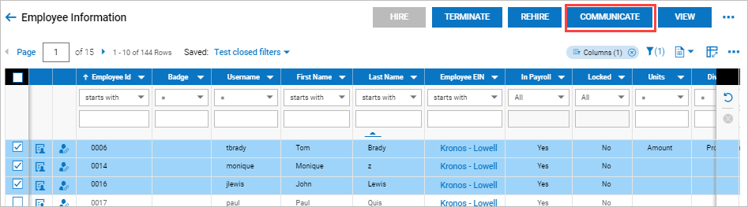

On the pop-up, you can manually create an SMS message and system tags
are available. If you have created templates, this is where you apply
them. Once a template is selected and applied, you will still have the
option to edit the text or enable/disable communication methods and also
enable the iCalendar attachment.

When enabling a calendar appointment, you must set the When/From/To
parameters for the appointment.

When sending out a Broadcast Message to employees, the option to specify
when to send (Date and Time) the message is available in the Schedule
section.

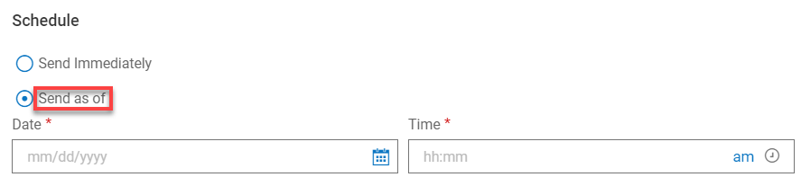

When ready, select the **Send** button and the SMS message will go out
to the recipient(s).

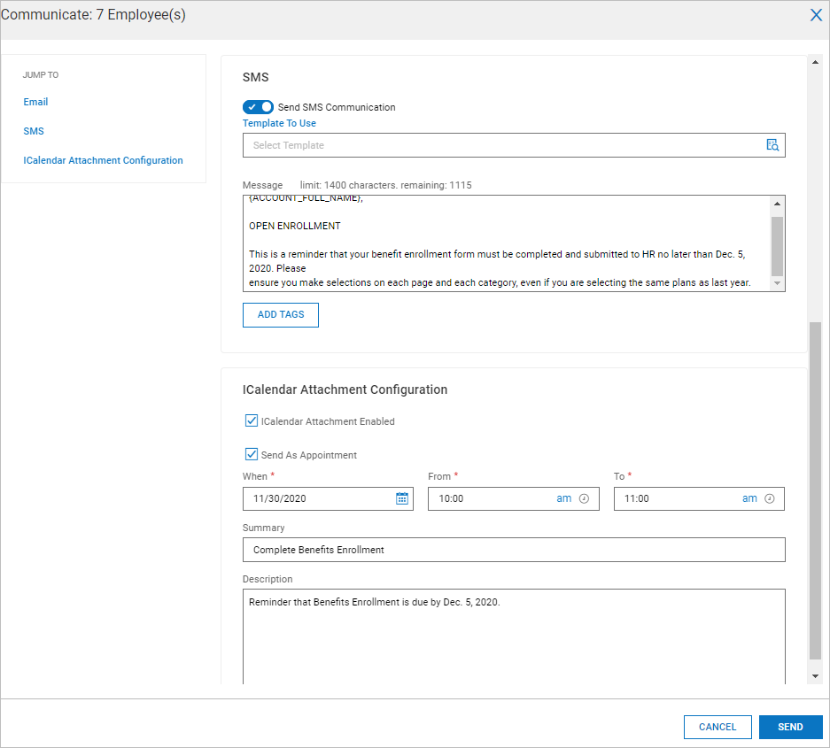

### System Generated SMS Report

Users with the appropriate security settings can view the history of
outgoing SMS communications within their company to allow for proper
accounting. The System Generated SMS report is available under **My Info
\> My Reports \> Marketplace Reports \> Twilio \> System Generated
SMS**.

This report is only visible if the **SMS Integration with
Twilio** **Marketplace** app is added to the company. In addition, users
must have the **System Generated SMS Report** security item enabled in
the **Marketplace Reports** section on the **Reports** tab in their
assigned Security Profile.

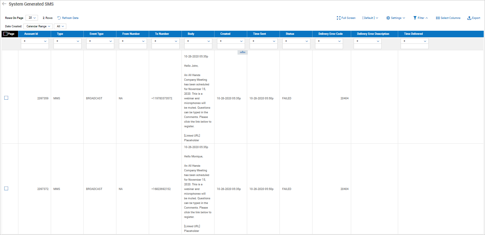

### User Generated SMS Report

Users can view the history of responses to SMS Communications within
their company for proper accounting using the User Generated SMS report
under **My Info \> My Reports \> Marketplace Reports \> Twilio \> User
Generated SMS Report**.

This report is only visible if the SMS Integration with
Twilio Marketplace item is added to the company. In addition, users must
have the **User Generated SMS Report** security item enabled in the
**Marketplace Reports** section on the **Reports** tab of their assigned
Security Profile to access this report.

### Partner Resellers Only: System Generated SMS Report 

In the System Generated Emails report, a new default column titled
**Event Type** has been added that will display the specific type of
method used for the message (for example: Broadcast, HR Action Request,
etc.).

## More Information on SMS Integration

The following sections cover some extra information for users of SMS
integration.

### Samsung Users

iCalendar attachments in messages can only be sent by Workforce Ready as
.ics files, and Twilio only supports the delivery of .ics files. The
default **Messages** app on Samsung devices only supports .vcs file
attachments. iCalendar attachments sent from Workforce Ready will not be
visible in the default **Messages** app on Samsung devices. To receive
iCalendar attachments from Workforce Ready, it is recommended that you
download **Android Messages** from the app store and use as your default
Messages app.

### Data Retention Users

If you use Data Retention to purge sensitive information from your
databases, a **System Generated SMS** data type will be available. If
data is hard-deleted, it can be tracked in the execution history.

## Subscribe Responses From SMS Text

When recipients receive an SMS text, they will have the option to
unsubscribe by responding with STOP. They will have the option to
resubscribe by replying with START. If they resubscribe, they will
receive a confirmation message from Twilio indicating they are
subscribed again.

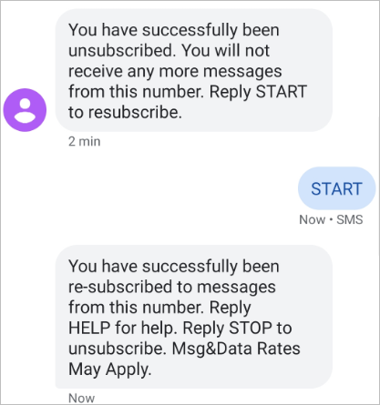

When users receive an SMS text message to approve or reject a request,
and the request is rejected and requires a comment as to why, the
instructions in the text message will clearly instruct the user how to
respond and allow them to enter the comment in the text message.

> **Example:** The Outgoing Message looks like this:
>
> Please reply Y/N followed by this code 73756 to Approve/Reject this request. If N, please also provide a brief comment.
>
> Reply STOP on +13173427186 to unsubscribe.

> **Example:** The Response/Reply looks like this:
>
> N 76542 Employee no longer eligible at this time.

### Two-Way SMS Messages for Scheduler

For companies with the Scheduler module enabled, some of the items that
can be sent via SMS text messaging require additional details in
addition to the approve/reject.

These items contain additional details related to the request.

> **Example:** Here is an example:
>
> Please reply Y/N \<space\> followed by this code 11234 to Approve/Reject
this request. Please note that the reply will automatically be
applicable to the first Peer to Approve Peer request. Please login to
WFR to change peers/modify this request.

This applies to **Schedule Open Shift**, **Schedule Request for
Coverage**, and **Schedule Shift Swap** items.