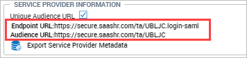

# Single Sign-On with SAML 2.0 and OAuth 2.0 User Guide

Single sign-on (SSO) is a user authentication process that permits a
user to enter a username and password once per session to access
multiple applications. A designated application provided by an
**Identity Provider (IdP)** must authenticate the user. The applications
that rely on the IdP to authenticate users are known as **Service
Providers (SP)**. The system supports Identity Provider-initiated and
Service Provider Single Sign-On using the HTTP POST binding.


[Download this User Guide as PDF](https://lookatthem-tech.github.io/portfolio001/Content/Topics/Developers/SSOwithSAMLandOauth/SSOSamlAndOAuthUG.pdf)


## Configuring Single Sign-On SAML 2.0

To configure Single Sign-On SAML 2.0, follow these steps:

1. **X.509 Certificate Requirement**  
   To implement SAML, an X.509 certificate is needed (which may be self-signed). The certificate uploaded to the company must directly correspond to the private key used to sign the SAML responses.  

   > **Note:** An option to import metadata from the identity provider is available. If you choose to import the metadata, this certificate will be included. This is the preferred approach for obtaining the X.509 certificate. If this is not possible, you will need to obtain the X.509 certificate from the identity provider directly.

2. **Enable Single Sign-On (SAML 2.0)**  
   The **Enable Single Sign-On (SAML 2.0)** option within the **Login/Logout Preferences** widget will need to be enabled.  

   - **UKG Ready™ Partners**:  
     Navigate to **Maintenance > Companies > All System Companies**, click the **Edit Company** icon, and check **Enable Single Sign-On (SAML 2.0)** within the **Login/Logout Preferences** widget.  
   - **UKG Ready™ Customers**:  
     Navigate to **Global Setup > Company Setup**, go to the **Login Config** tab (or add the Login/Logout Preferences widget to any tab), and check **Enable Single Sign-On (SAML 2.0)**.  

   

3. **Provide Service Provider Information to IdP**  
   To enable identity providers to begin SSO configuration, provide them with:  
   - **Endpoint URL** and **Audience URL** (found in the **Service Provider Information** section of the **Login/Logout Preferences** widget).  

   **Endpoint URL Examples**:  
   - US: `https://secure.saashr.com/ta/company.login-saml`  
   - EU: `https://secure.workforceready.eu/ta/company.login-saml`  
   - AUS: `https://secure.workforceready.com.au/ta/company.login-saml`  

   **Audience URL Behavior**:  
   - If **Unique Audience URL** is checked: Includes company domain and short name.  
     - Examples:  
       - US: `https://secure.saashr.com/company`  
       - EU: `https://secure.workforceready.eu/company`  
       - AUS: `https://secure.workforceready.com.au/company`  
   - If unchecked: Uses company domain only.  
     - Examples:  
       - US: `https://secure.saashr.com`  
       - EU: `https://secure.workforceready.eu`  
       - AUS: `https://secure.workforceready.com.au`  

4. **Export Service Provider Metadata**  
   After setting the Unique Audience URL, generate an XML file for the IdP by clicking **Export Service Provider Metadata**. If the IdP cannot import XML, manually enter the information from the **Service Provider Information** section.  

   

5. **Configure Additional Settings**  
   - **Redirect URL For Login**: The Single Sign-On Service URL provided by the IdP (required for SP-Initiated SSO).  
     > **Note:** Configure this after SSO is fully set up to avoid redirecting active users unexpectedly.  
   - **Bypass Redirect URL**: URL for direct logins (bypassing external IdP).  
   - **URL To Show On Logout**: Post-logout redirect URL.  
   - **Session Validation URL**: For older SSO versions (remote login).  
   - **Import Metadata From Identity Provider**: Uploads IdP-provided Entity ID, Redirect URL, and X.509 Certificate.  
       
   - **Set Login URL For SP-Initiated SSO**: Overrides Redirect URL with imported metadata.  
       
   - **Entity ID of Identity Provider**: Your IdP’s unique identifier.  
   - **Error Handling**: Configure Error URL and parameter names for error messages/numbers.  
   - **Upload X.509 Certificate**: Manually upload the IdP-provided certificate.  

---

### SP Initiated SSO Example - How It Works  
1. User clicks a login link from an email.  
2. Redirected to the login URL with `RelayState` (e.g., `https://login-redirect-url?RelayState=2g53i5g32523rfghdf`).  
3. IdP creates a SAML response (POSTed to the endpoint URL):  
   ```xml
   SAMLResponse=response&RelayState=2g53i5g32523rfghdf
   ```  
   **Endpoint URLs**:  
   - US: `https://secure.saashr.com/ta/company.login-saml`  
   - EU: `https://secure.workforceready.eu/ta/company.login-saml`  
   - AUS: `https://secure.workforceready.com.au/ta/company.login-saml`  
4. After verification, user is redirected based on `RelayState`.  

---

### Sample SAML Response  
Placeholders:  
- `[[IDP_ENTITY_ID]]`: Identity Provider’s Entity ID.  
- `[[COMPANY_SHORT_NAME]]`: Your company’s short name.  
- `[[USERNAME]]`: Valid employee username.  

```xml
<?xml version="1.0" encoding="UTF-8"?>
<samlp:Response xmlns:samlp="urn:oasis:names:tc:SAML:2.0:protocol" ID="..." IssueInstant="2023-03-03T19:07:11.975Z" Version="2.0">
  <saml:Issuer>[[IDP_ENTITY_ID]]</saml:Issuer>
  <ds:Signature>...</ds:Signature>
  <samlp:Status>
    <samlp:StatusCode Value="urn:oasis:names:tc:SAML:2.0:status:Success"/>
  </samlp:Status>
  <saml:Assertion>
    <saml:Issuer>[[IDP_ENTITY_ID]]</saml:Issuer>
    <saml:Subject>
      <saml:NameID>[[USERNAME]]</saml:NameID>
    </saml:Subject>
    <saml:Conditions>...</saml:Conditions>
    <saml:AuthnStatement>...</saml:AuthnStatement>
  </saml:Assertion>
</samlp:Response>
```

---

### E-Signatures  
To avoid confusion, configure the **Electronic Signature Uses** field (under **Signature Settings** widget) to use a field other than `Password`.  

  

---

### Errors  
- **SAML 2.0 Errors**: Check **System Events** report (`Company Settings > System > Events`).  
- **Username Issues**: View **Global Access** report (`My Info > My Reports > System Reports`).  

  

---

### Multi-Tenant IDP (Partner Resellers Only)  
Enable **Multi-Tenant IDP** at the Partner Admin Company Level to use a global IdP. The IdP must send the company short name via a `companyId` SAML attribute.  

  

---

### Google SSO on Mobile App  
Requires **Google Cloud Integration Marketplace** product (domain must match company domain). Users must log in with their company Google account (consumer accounts unsupported).  

  
  


## Active Directory, ADFS, and Azure with SAML 2.0

This section is provided for the convenience of our users who use
Microsoft ADFS and/or Azure for SSO. It is not intended to be used for a
complete deployment, troubleshooting, or configuration guide.  For
technical support regarding these Microsoft products, a wealth of
information is available at Microsoft and other sites, including:

- [https://docs.microsoft.com](https://docs.microsoft.com)

- [https://techcommunity.microsoft.com](https://techcommunity.microsoft.com)

- [https://msdn.microsoft.com](https://msdn.microsoft.com)

- [Integrating SAML support with
  ADFS](https://www2.microstrategy.com/producthelp/10.8/SystemAdmin/WebHelp/Lang_1033/Content/Admin/integrate_saml_with_adfs.htm)

### How to Set Up a Federation with the System using ADFS 2.0

Two steps are required to set up a federation between ADFS 2.0, the IdP,
and the system, which is a trusted resource in this scenario. You will
need to obtain an X.509 certificate and establish a trust relationship
between the system and the ADFS 2.0 server.

In this scenario, the user enters the URL for the system in a browser or
clicks a link from an email. When the system receives the request, it
checks the request to determine if the user has been authenticated. If
the authentication data is present, the user can access the system and
is redirected back to the URL that they were initially attempting to
access.

If the authentication data is not present, the request is redirected to
an ADFS server for authentication. The system includes the X.509
certificate in any requests to authenticate the user. If the X.509
certificate is valid, the user is asked to login through ADFS. If
authenticated, the request is redirected back to the original URL.

For all pieces to work correctly in this scenario, you must complete two
steps.

1.  Obtain the certificate from the ADFS side and import it or upload it
    to the system.

2.  Import data about the system into ADFS. ADFS requires this step when
    configuring a Relying Party Trust.

### Importing or Uploading the ADFS Certificates

To set up the certificate on the ADFS side, you can use a self-signed
certificate generated by ADFS or use a different certificate. Two
approaches can be used.

The recommended approach requires fewer manual steps. In this approach,
the certificate is contained in the metadata XML file. The metadata can
be downloaded from
https://\<server\>/federationmetadata/2007-06/federationmetadata.xml,
where \<server\> is the ADFS server.

The metadata must then be imported to the system in the Enable Single
Sign-On (SAML 2.0) section:

- **UKG Ready™ Partners**: This is done in the **Login/Logout
  Preferences** widget in the **Company Information** page.

- **UKG Ready™ Customers**: This is done in the **Login/Logout
  Preferences** widget in the **Global Setup** \> **Company
  Information** page.


#### Multiple X.509 Certificates

Multiple X.509 certificates can be uploaded, and as a result, a new
certificate can be uploaded alongside a soon-to-expire certificate to
allow a simpler transition from the old certificate to the new one.

Expired or duplicate certificates cannot be uploaded, and a warning
displays if a duplicate is uploaded. When a certificate is no longer
valid, it is automatically removed after 15 days. Certificates display
in a table for better readability.

An option to **Replace Existing Certificates** is available when
importing metadata. When enabled, importing metadata deletes the
existing certificate(s) and replaces it with the one from the metadata.

Expired certificates are hidden by default, and they can be shown when
the **Show Expired Certificates** checkbox is enabled. This checkbox is
only visible when the company has any expired certificates. The **Valid
To** date displays in red for expired certificates.

> **Note:** If
all certificates are expired, the **Show Expired Certificates** checkbox
is always enabled and all expired certificates are always shown.


### Manual Process (Not recommended)

As an alternative, the certificate can be downloaded directly by logging
into the ADFS server. 

1.  Start the Microsoft Management Console.

    You will need to run the Microsoft Management Console (MMC) program
    by clicking on **Start**, then selecting **Run** and entering "MMC".

2.  Start the Certificate Snap-in Wizard.

    Click on the **File** menu option and select **Add/Remove
    Snap-in...** Then select **Certificates** and click on **Add**.

3.  Specify where to get the file.

    After the Certificate Snap-in wizard starts, select **Computer
    account** and click the **Next** button.

    Since you are pulling the file from the local system, select **Local
    computer,** then click the **Finish** button and then click **OK**.

4.  Select the certificate.

    Expand **Console Root\\Certificates (Local
    Computer)\\Personal\\Certificates**. Select the X.509 certificate by
    right-clicking on it. Select **All Tasks**, then click **Export**
    and then click **Next**.

    Choose **No, do not export the private key option**, then click
    **Next**.

    Choose the **Base-64 encoded x.509(.CER)** option, then click
    **Next**.

    Enter a file path and name then click the **Next** button.

    You should see a pop-up reading **The export was successful**, and
    you can click OK, then save and upload the exported file into the
    system using the **Upload X.509 Certificate** option.

    
    
### Configuring Relying Party Trust Information

The ADFS 2.0 Management snap-in will be used to configure Relying Party
Trust Information. From that tool, you can navigate to **ADFS 2.0 \>
Trust Relationships \> Relying Party Trusts**.  You'll need to
right-click on **Relying Party Trusts** and select **Add Relying Party
Trust**.

A wizard will start. Click the **Start** button. Two options are
available, an import and manual text entry. The import option is
recommended. Manual entry should only be used if your IdP cannot import
the data from a file. This is not the case with ADFS.

#### Recommended Option: Importing the Service Provider Data into ADFS

If you have exported service provider metadata from the **Login/Logout
Preferences** widget, you can upload the file. Within the **Relying
Party Trust** wizard, choose **Select Data Source** and upload the file
using the **Import data about the relying party from a file** option.


For **Display** name, enter any name (for example, **Trusted Resource**)
and click the **Next** button.

### Manually Entering the Relying Party Information

If your IdP cannot import a file, the alternative is to choose **Enter
data about the relying party manually** option and click the **Next**
button.

You'll need to step through each of the sections in the **Relying Party
Trust** wizard.

1.  In the **Specify Display Name** section, enter any name for
    **Display** (for example, **Trusted Resource**) and click the
    **Next** button.

2.  For the **Choose Profile** section, select **AD FS 2.0 profile** and
    click the **Next** button.

3.  For the **Configure Certificate** section, click the **Next** button
    as the system does not support a token encryption certificate.

    
    
4.  For the **Configure URL** section, check **Enable support for SAML
    2.0 Web SSO protocol**. For the **Relying party SAML 2.0 SSO**
    service URL, enter the Service Provider (SP) URL. This is the
    Endpoint URL shown in the **Service Provider Information** in the
    **Login/Logout Preferences** widget.

    
    
5.  Click the **Next** button.

6.  In the **Configure Identifiers** section, you'll need to enter some
    system URLs. In the **Relying party trust identifier**, the system's
    SAML endpoint needs to be entered. This is the Audience URL shown in
    the **Service Provider Information** in the **Login/Logout
    Preferences** screen, for example: <https://secure2.saashr.com>

    
    
7.  Click the **Add** button then click the **Next** button.

8.  For the **Choose Issuance Authorization Rules** section, select
    **Permit all users to access this relying party** then click the
    **Next** button.

9.  For the **Ready to Add Trust section**, you can review the
    configuration on this screen. Once you are satisfied with the
    information click the **Next** button.

10. Click the **Close** button.

#### Claim Rules

You should now see a dialog box to add Claim rules to the **Trusted
Resource** relying party that was just configured. There is only one
claim that needs configuration before sending to the system: Name ID.
The next steps show you how to configure this. As with any federation
configuration, case sensitivity is critical. Please make sure to use the
matching case when configuring the claim names.

1.  In the **Trusted Resource Claim** rules click the **Add** button.

2.  For the Claim rule template field, select **Send LDAP attributes as
    Claims** then click the **Next** button.

3.  Enter any name for the Claim rule name, for example, **Name ID.**

4.  For the **Attribute store** field, drop down and select **Active
    Directory**.

5.  In the **LDAP Attribute** section, drop down and select
    **SAM-Account-Name**.

6.  In the **Outgoing Claim Type** section, drop down and select **Name
    ID**.

    
    
7.  Click the **Finish** button.

8.  Click the **OK** button on the Claim rule configuration for
    **Trusted Resource**.

    Since we have configured this as a SAML assertion we can use the
    LoginToRP feature with the IDPInitiatedSignon page to get the users
    signed into ADFS and then redirect them to WFR. Here is an example
    of this assuming that the ADFS server name is adfs.example.com. The
    URL would be:

    https://adfs.example.com/adfs/ls/IDPInitiatedSignon.aspx?LoginToRP=https://secure.entertimeonline.com


## Configuring Single Sign-On OAuth 2.0

OAuth 2.0 (Open Authorization) provides clients secure delegated access
to server resources on behalf of a resource owner. It specifies a
process for resource owners to authorize third-party access to their
server resources without sharing their credentials.

Designed specifically to work with Hypertext Transfer Protocol (HTTP),
OAuth 2.0 essentially allows access tokens to be issued to third-party
clients by an authorization server, with the approval of the resource
owner. The third-party then uses the access token to access the
protected resources hosted by the resource server.

It works by delegating user authentication to the service that hosts the
user account and authorizing third-party applications to access the user
account. OAuth 2.0 provides authorization flows for mobile devices, as
well as web and desktop applications.

> **Note:** For
Partners, OAuth 2.0 can be added to Admin and Holding companies, but
each client company must be configured individually.

### Configuring OAuth 2.0

Enable OAuth 2.0 in the **Available Functionality** widget of your
company. Check the OAuth Configuration checkbox, save and then log in as
SA. This will make the widget available in Company Setup.


Navigate **to Company Settings \> Global Setup \> Company Setup**. From
**Edit Tabs**, locate and drag the OAuth Configuration widget to the tab
of your choice and save.


From the widget, select Add New to create a new tenant.


With the exception of the **Account Reference** fields, the remaining
fields will come from the authorization server. There are multiple OAuth
vendors available. Once you have chosen one and have set up your
account, the vendor will provide you with the information you need to
complete this widget.

- **Client ID**: This is a required field and the ID will be generated
  by the authorization server.

- **Client Secret**: This is a required field and acts as a password.

- **User Identifier**: This is a required field. This identifier is the
  name of the standard field (claim) that identifies the subject (user)
  of the Access Token. It is used to identify the system user account in
  our system.

- **Account Reference**: This is a required field. You can select
  Account ID, Employee ID, External ID, or Username. This is used to
  match the user account information to the User Identifier value from
  the Access Token.

- **Authorization URL**: The authorization URL generated for your
  company from the authorization server.

- **Access Token URL**: The access token URL generated for your company
  from the authorization server.

- **Introspection URL**: The introspection URL generated for your
  company from the authorization server.

- **Tenant Identifier**: The name of the standard field (claim) that
  identifies the tenant (company) of the Introspection Token.

- **Tenant Name**: The expected value of the tenant. It should be
  matched to the Tenant Identifier value from the Introspection Token.


## Differences Between SAML 2.0 and OAuth 2.0

You can use SAML 2.0 or OAuth 2.0 for Single Sign-On authorizations.
Consider these differences between the two options.

- OAuth 2.0 is primarily built for mobile environments.

- SAML 2.0 is more geared for desktop environments.

Also, be aware of the different definitions for the same terms between
the two options.


### SAML 2.0 Flow


### OAuth 2.0 Flow

