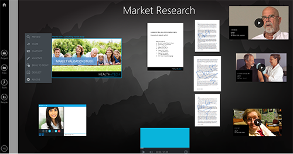

# Collaborate with anyone, anywhere, any time

That\'s a lot to promise you --- that you can collaborate with
anyone\... anywhere\... any time. But Prysm makes that promise and
fulfills it for you! Here\'s how:

## Collaborate with anyone

Collaborate with:

- Remote employees at your own company
- Contractors who don\'t have the same access to your company\'s assets
- People from other companies
- Literally anyone capable of receiving an email and clicking a link!

Just go to Prysm for web ([app.prysm.com](http://app.prysm.com/)) and
create a free account. [Create a
project](../Project/Projects.htm#CreatingProjects). (**Projects** are
anything you want to organize, such as planning an event, or
brainstorming about a new product.)

Then, on Prysm\'s People panel, invite the people you want to join you
for collaboration. Prysm sends them an email with a link that takes them
directly into your Prysm [workspace](../Project/Workspaces.html), where
you add [sketches](../Tools/Sketchboards.html#OpeningSketchboards),
images, documents,
[files](../Files/WorkingWithProjectFiles.htm#AddingProjectFiles), and
other rich content. (**Workspaces** are places where you can store and
visually organize your content.)

## Collaborate anywhere

Prysm has apps for all your devices, so that you can work wherever you
are --- and you can collaborate with anyone who is working wherever
THEY are. Try all the Prysm apps:

- **Prysm for web:** Work from your web browser, as you do with all your
  web apps. Get the app at [app.prysm.com](http://app.prysm.com/).
- **Prysm for desktop:** Work from a Prysm app that seamlessly
  integrates with your Windows computer, enabling you to instantly share
  single applications or your entire desktop with others in your Prysm
  workspace. Get the app at [the Microsoft Store on your Windows 10
  device](../GettingStarted/GettingPFD.html#InstalliingPFD).
- **Prysm for iPhone:** For the ultimate convenience, from your iPhone,
  you can [add content](../Files/AddingContentUsingIPhone.htm), [add
  people](../People/AddingPeopleIphone.html), and [sign in to Prysm
  displays](../GettingStarted/UnlockingDisplayUsingIPhone.htm). Get the
  app at [the Apple App
  Store](../GettingStarted/GettingPFI.html#InstallingIPhone).
- **Prysm for rooms:** Work on large portable or wall displays in
  conference rooms and collaboration spaces. Get the app by contacting
  [Prysm Support](https://www.prysm.com/support/) or emailing support.

All Prysm apps are touch-enabled (even on large video walls with Prysm
for rooms) and as easy to use as your smart phone.

 

## Collaborate any time

Unlike traditional, meeting-only apps, your Prysm projects are \"always
on\" and available to you and your collaborators. Content that you add
to your project remains exactly as you left it, so that anyone can pick
up where anyone else stopped and make progress any time.

This helps you overcome time zone challenges --- because when you
collaborate with people across the globe, they are often not available
to collaborate with you during your work day. With Prysm, your global
colleagues can make progress toward your goals during their workday, and
you can pick up where they left off during yours. It also smooths issues
with your collaborators whose calendars are always fully booked. You can
work in Prysm any time, and those busy folks can peek in on your
progress in Prysm whenever they\'re able.

Prysm also is the perfect solution for large-scale meetings and
presentations, where everyone is actually meeting and collaborating at
the SAME time! Gather a bunch of people in a conference room where you
present via Prysm for rooms, while those across the globe, who can\'t
physically join you in the conference room, have an immersive,
interactive meeting experience with you via Prysm\'s other apps.

